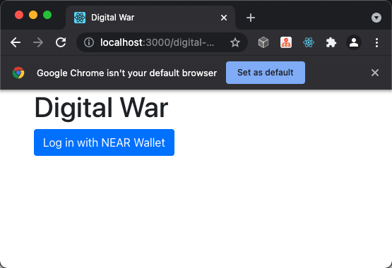
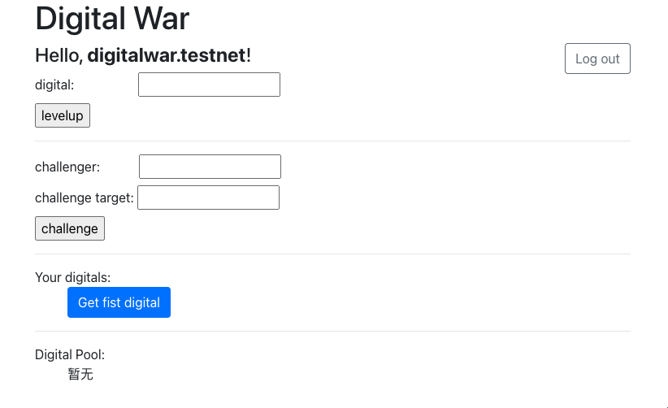
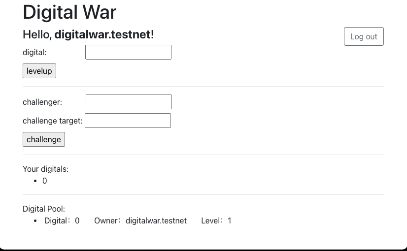
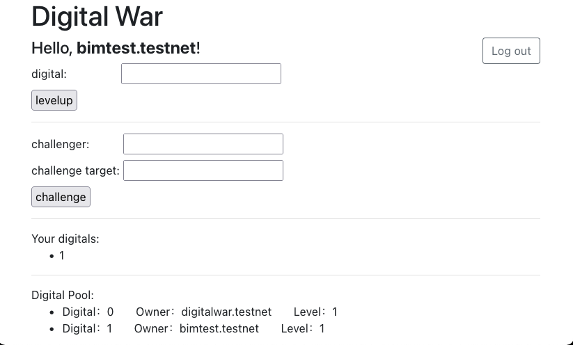
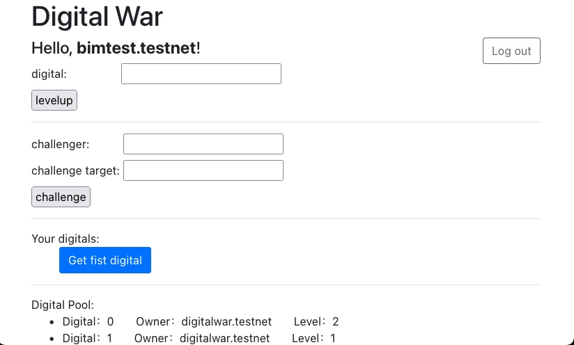

# digital-war

Digital-war is a digital dight game based on the NEAR protocol.

## concept

The contract provides digital capture, digital upgrade and digital challenge capabilities.

Use the first digital you get for free to get your favorite lucky number through the challenge.

## Getting Started

1、clone this repo
```shell
git clone https://github.com/MagicGordon/digital-war
```

2、run frontend

```shell
cd frontend
yarn install
yarn start
```
If all goes well, you'll be able to play by accessing address http://localhost:3000/digital-war in your browser.

> [Option]
> 
> If you want to deploy a new dev contract, you need to do the following steps before run frontend:
> 
> ```
>   cd digital-war/contract
>   ./build.sh
>   near dev-deploy res/digital_war.wasm
>   near $new-contract-id new --account-id $new-contract-id
> ```
> Then modify the variables  `ContractName` in file frontend/src/App.js.

## Example Story

1、first visit



2、login



3、Click the `Get first digital` button, wait for the `success` popup, and you will get your first digital.



4、Log in with another user in a different browser,and get first digital.

In the digital pool, you can see the information about the number obtained by the previous user



5、You can spend 0.01 near to upgrade the numbers and then challenge them, or challenge them directly.

The higher the number level, the easier it is to win. the winner level +1, and the loser level -1.

When the level is 0, the number changes the owner to the winner.

6、When your last number is lost, you can take it for free again. The `Get first digital` button will reappear.




7、A pop-up box will appear after `challenge` and `Get first digital` operation. Please wait patiently. Have a good time!
